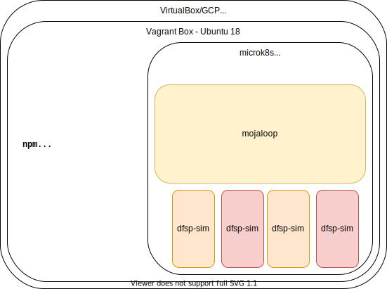

# Mini-loop with K8s v1.20
Opinionated Mojaloop 'in a box' using Vagrant, K8s and Helm.

Quick start
```bash
git clone https://github.com/tdaly61/mini-loop.git
cd mini-loop/vbox-deploy
vagrant up
```

## Overview

Mini-loop is a simple, opinonated 'out of the box' installation of [Mojaloop](https://mojaloop.io) for test and demonstration purposes. The goal is to make it easy and reliable to deploy Mojaloop locally.
This project automates the instructions for the linux installation in the mojaloop documentation at https://docs.mojaloop.io/documentation/deployment-guide/local-setup-linux.html. 
## Description / Approach

Using Hashicorp Vagrant, a VirtualBox Ubuntu VM is created and all of the components required to run mojaloop are automatically installed and configured into this VM. Once the VM is booted the mojaloop helm chart is deployed and the mojaloop kubernetes pods and services created, the mini-loop configuration automatically runs the mojaloop testing toolkit (https://docs.mojaloop.io/documentation/mojaloop-technical-overview/ml-testing-toolkit/) using "helm test ml". The testing toolkit performs the data setup and executes the Golden_Path test collections against this mojaloop installation.  

Once the Golden_Path tests have completed, users can interact with the installation. Refer to the instructions below on logging into the VM and also on using the Moble Simulator Demonstration. 


## Prerequisites 

### 
- [HashiCorp `vagrant`](https://www.vagrantup.com)
- `git`  
- [Virtualbox v6.1 and accompanying Guest Additions](https://www.virtualbox.org/wiki/Downloads)
> On MacOS, you can use homebrew:

```bash
brew cask install virtualbox
```

> Note: you can install guest additions directly onto Vagrant with [vagrant-vbguest](https://github.com/dotless-de/vagrant-vbguest). 

- [HashiCorp `vagrant`](https://www.vagrantup.com)
- min 6GB ram available  (8GB or more recommended) 
- min 64GB storage available
- broadband internet connection (for downloading linux images in the form of vagrant boxes and the helm charts to install mojaloop)
## Setup and use 

### Deployment 
```bash
git clone https://github.com/tdaly61/mini-loop.git
cd mini-loop/vbox-deploy
vagrant up #creates the virtualbox VM, boots and configures the OS, deploys mojaloop and runs the Testing Toolkit
```
## Using the Testing Toolkit

- Browser access to the testing toolkit is possible from the host machine but 2 steps are necessary 
  - Establish a port-forward on port 8080 on the host to port 80 in the VirtualBox guest, this will be done automatically
    by mini-loop. 
  - Add the following enties to the locahost entry in the /etc/hosts file (linux) of the HOST machine :
    testing-toolkit.local testing-toolkit-specapi.local 
    The resulting /etc/hosts file (linux) should have an entry similar to:-
    ```bash
      127.0.0.1 localhost testing-toolkit.local testing-toolkit-specapi.local 
    ``` 
  - you can now Browse to http://testing-toolkit.local:8080/ you should see the main page for the Testing Toolkit

- For a good overview of the Testing Toolkit functionality please see the video (https://www.youtube.com/watch?v=xyC6Pd3zE9Y),
  please note the mobile simulator demonstration which starts at about 2:53. 
- Full documentation for the Testing Toolkit (https://github.com/mojaloop/ml-testing-toolkit/blob/master/documents/User-Guide-Mojaloop-Testing-Toolkit.md) 
## Accessing the Mobile Simulators from the host machine browser
- Browse to http://testing-toolkit.local:8080/ then click `demos` in the bottom left hand menu then click `mobile simulator` 
  you should see a page featuring 2 mobile phones 
- click on the `red circle` in the upper middle of the page and then click `start provisioning` button to load the demo data
- Once the data loading has finished close the provisioning window.
- The demo should be ready to run. Start interacting by clicking the `search icon` in the pink bank phone.  

## Architecture

Mini-Loop uses Vagrant to deploy a single instance kubernetes cluster inside a VirtualBox guest VM. Here's a rough idea of what that looks like:



Additionally, Vagrant mounts the scripts needed to bootstrap the environment into the VirtualBox VM.

Feel free to ssh into your running Vagrant box, and try out the following commands:
```bash
# ssh into the running box
vagrant ssh

# view the running pods
kubectl get po

# tail some logs
kubectl logs -f <pod_name>

# view the deployments
kubectl get deployments

# list the helm deployments
helm list

# display results from the Golden Path test collection
kubectl logs pod/ml-ml-ttk-test-validation
```

## Handy Vagrant Commands:

```bash
vagrant status # shows running vms

vagrant halt # stops vm but does not destroy

vagrant up # starts vm , use --provision flag to re-run provisioning

vagrant destroy # destroys VM (will terminate resources / save money if using GCS)
```

## Notes:
- You can use the VirtualBox GUI console to examine the VM.
- Virtualbox NAT networking with port forwarding on port 8080 (host) to 80 (guest) is used to enable access to the Web UI of the Testing Toolkit
- You can add the port forward or remove it anytime after deployment using the VirtualBox Gui console (https://www.virtualbox.org/manual/ch06.html#natforward) alternatively you can use the VBoxManage commands:-
  - VBoxManage controlvm "mini-loop" natpf1 "tcp80,tcp,,8080,,80"  # to add port forward to running guest VM
  - VBoxManage controlvm "mini-loop" natpf1 delete tcp80           # to delete port forward from running Guest

mini-loop is tested so far with:
- OSX VirtualBox host
- Virtualbox 6.1.6
- ubuntu 1804 guest (via hashicorp published vagrant box)
- vagrant  2.2.18
- Linux (though modern windows releases should work)

## notable changes in v1.1
- dropped support for deployment to GCS (but will add back in if there is demand)
- updated to Mojaloop v13.0.x
- updated K8s version to v1.20.x
- automatic testing of the mojaloop deployment is now performed with the mojaloop Testing Toolkit rather than postman. For details please refer to section 5.3 of the mojaloop deployment guide (https://docs.mojaloop.io/documentation/deployment-guide/#32-kubernetes-admin-interfaces). Also see the section above on the testing toolkit  
- Instead of demonstrating the function of mojaloop with .sh scripts the Mobile Simulator demo of the Testing Toolkit is now used.

## FAQ

1. I think it installed correctly, but how do I verify that everything is working?

  The Mini-loop automation runs the mojaloop Testing Toolkit and reports errors if 100% of the Golden Path tests do not pass, so if your logs on `vagrant up` look ok, then you can be confident that everything is up and running just fine.

  You can also run the Testing Toolkit yourself from the Web UI (see instructions above)


2. I'm having issues with `\r`'s on Windows (`$'\r': command not found`)

  When testing on Windows, we observed that carriage returns (`\r` characters) were being appended to our scripts, which causes some bash scripts to fail once Vagrant mounts the scripts into the vagrant box. Our workaround for the following is to remove them inline and pipe to bash, like so:

  ```bash
  sed 's/\r$//' /vagrant/scripts/02_run_ttk.sh | /bin/bash
  ```

  You could also update the file in place like so:
  ```bash
  sed -i 's/\r$//' /vagrant/scripts/02_run_ttk.sh
  /vagrant/scripts/02_run_ttk.sh
  ```

  This however could create issues down the line where you may need to re-run the above script if you make changes to the `02_run_ttk.sh` script from the Windows host.