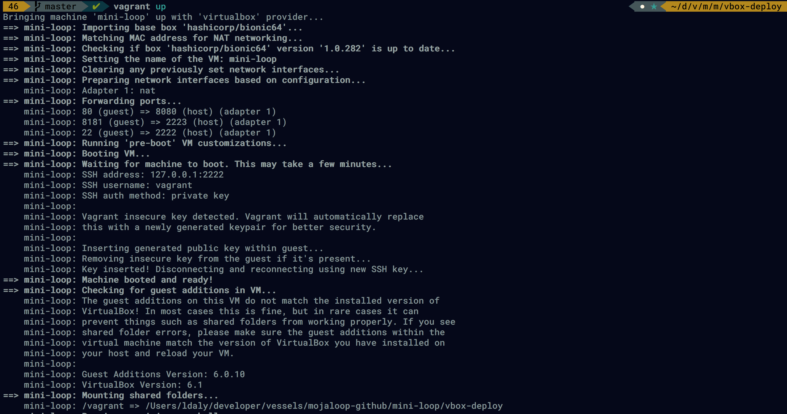
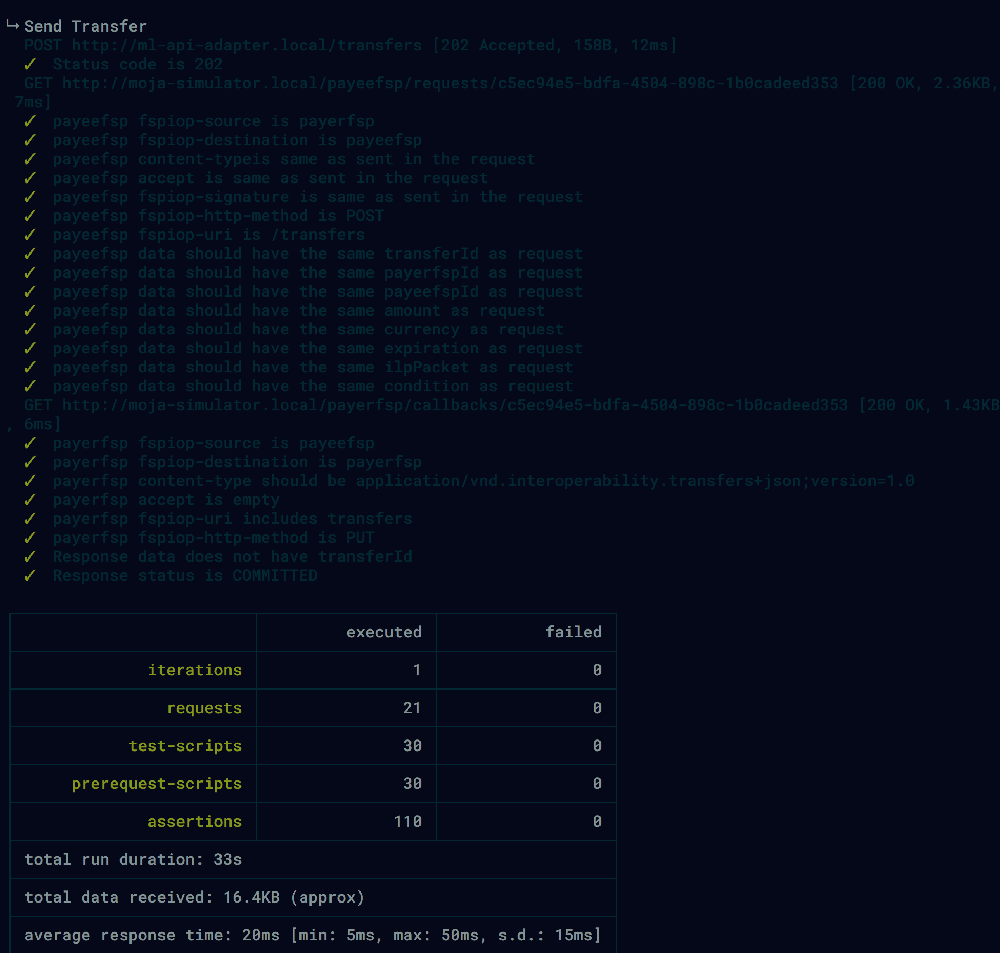

# Mini Loop

Mini-loop is an opinionated, batteries-included installation of Mojaloop, designed for newcomers to the Mojaloop community who want to get a working example of Mojaloop without worrying about Kubernetes, Helm and our Postman tests.


## Motivation

We noticed that a lot of newcomers to the Mojaloop community struggled to get a local installation working through the [installation steps](https://docs.mojaloop.io/documentation/deployment-guide/), and the many different options presented for an installation (which OS, which Kubernetes environment ad version, which Helm version to name a few) was sometimes hard to understand, especially for newcomers to Kubernetes and Helm.

So we set out to make Mini-Loop, which can be installed in a few steps:

```bash
git clone https://github.com/tdaly61/mini-loop.git
cd mini-loop/vbox-deploy
vagrant up
```

> Well, it's not quite that easy, there are a few prerequisites you may need to install, namely VirtualBox and Vagrant.

Should everything work as expected, you will have:
1. An Ubuntu virtual machine, with MicroK8s and Helm3
2. Mojaloop `v10.1.0` installed on MicroK8s
3. Seeded databases, with configuration for 2x simulated DFSPs
4. Passing 'Golden Path' Mojaloop tests


## Set Up

### Hardware

In order to run Mini-Loop sucessfully, we recommend the following hardware requirements:

- minimum `6GB` ram available  (`8GB` recommended) 
- minimum `32GB` storage available
- broadband internet connection (for downloading initial linux images in the form of vagrant boxes. if your internet connection is slow you may want to consider using the [Google Cloud Version](https://github.com/tdaly61/mini-loop#google-cloud-deployment) instead)

### Software

Mini-loop uses Vagrant to manage the Mojaloop Virtual Machine (VM), which in turn uses VirtualBox. Before proceeding, make sure you have installed:

- [HashiCorp `vagrant`](https://www.vagrantup.com)
- [Virtualbox and accompanying Guest Additions](https://www.virtualbox.org/wiki/Downloads)

>You may also find the following links helpful to get up and running with Vagrant and Virtualbox
>- [Getting Started with Virtualbox and Vagrant](https://medium.com/@AnnaJS15/getting-started-with-virtualbox-and-vagrant-8d98aa271d2a)
>- [Installing VirtualBox and Vagrant on Windows 10](https://medium.com/@botdotcom/installing-virtualbox-and-vagrant-on-windows-10-2e5cbc6bd6ad)


## Installing Mojaloop

```bash
git clone https://github.com/tdaly61/mini-loop.git
cd mini-loop/vbox-deploy
vagrant up
```

`vagrant up` is where the magic happens. This step does:
1. Downloads an Ubuntu image and runs a virtualbox Virtual Machine (VM)
2. Boots and configures the VM
3. Installs Kubernetes, Helm and Postman
4. Downloads and installs the Mojaloop Helm Charts
5. Downloads and runs the Mojaloop Golden Path tests

The first part should look something like the following:




And when you see something like:


That is the end of the golden path tests, and your Mini-loop environment is up and running.


## Verifying Everything Works

As a part of `vagrant up`, the Mojaloop environment is configured, and the golden path tests are run. So should your `vagrant up` command succeed, then you can be pretty confident that everything is working as expected. Make sure to read the console output however, just to be sure.

### Running an Example Transfer

We also provide some shell scripts so you can run your own example Mojaloop transfer:
```bash
# log into the vagrant box
vagrant ssh

# run an example transfer
/vagrant/scripts/_example_transfer.sh
```

Which will look something like the following:
```bash 
$/vagrant/scripts/_example_transfer.sh
Setting up environment
Creating the transfer (request from Payer -> Payee)
Created a transfer with TRANSFER_ID: 9b9bd5dc-7ca6-84a8-da71-44e6f8c4472e

fulfilling the transfer (request from Payee -> Payer)
Approved transfer: 9b9bd5dc-7ca6-84a8-da71-44e6f8c4472e

Get Payer Position
[{"currency":"USD","value":103.11,"changedDate":"2020-07-20T12:33:09.000Z"}]
Success

Get Payee Position
[{"currency":"USD","value":-203.11,"changedDate":"2020-07-20T12:33:09.000Z"}]
Success
```

If you run the `_example_transfer.sh` script more than once, you should see the DFSP positions gradually change more and more over time.

## Troubleshooting

If you run into any problems getting Mini-Loop set up, or have any other questions, you can:
- Reach out to `@Tom Daly` or `@Lewis Daly` on the [Mojaloop Slack](https://mojaloop.io/slack)
- Post your question in the `#help-mojaloop` channel
- Open an issue on the [Mini-Loop GitHub Repo](https://github.com/tdaly61/mini-loop.git)
